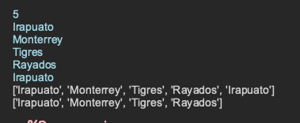
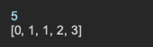

# Ejercicios con el uso de listas

# - A02 Contar Pares Impares, mayor, menor, lista ordenada:
:sparkles:  

# - A07 Pares y Posición:
:sparkles:  

# - A08 Listas Sin Duplicados:
:sparkles:  
-
:sparkles:  

# - A09 Serie Fibonacci Listas:
:sparkles:  
-
:sparkles:  
